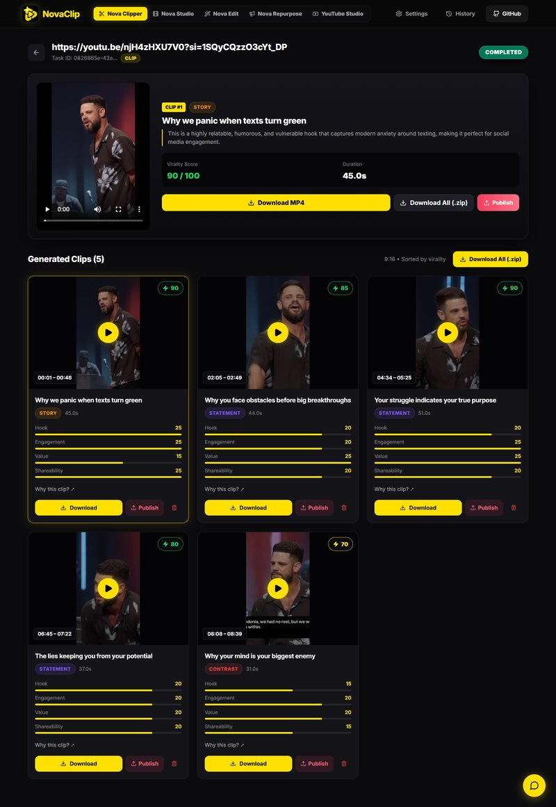
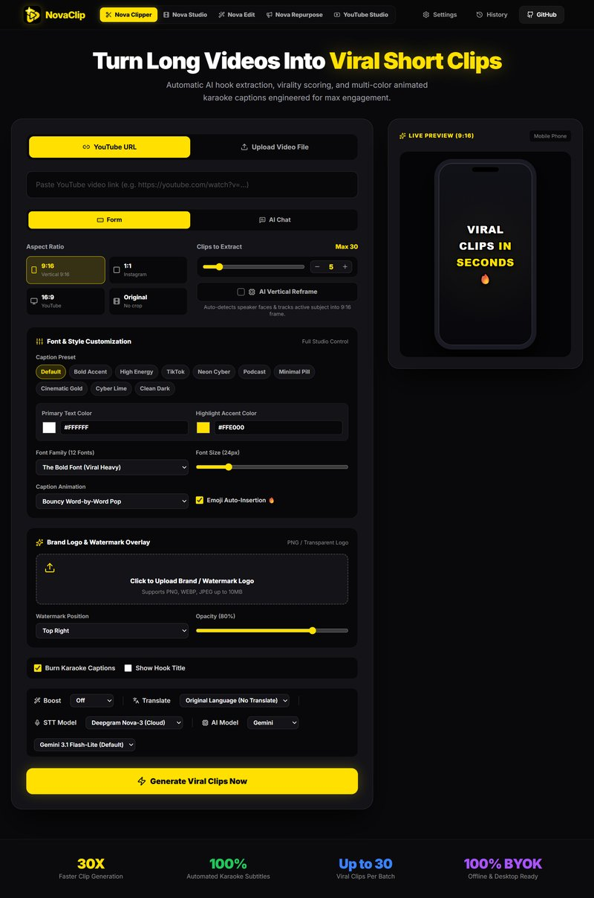
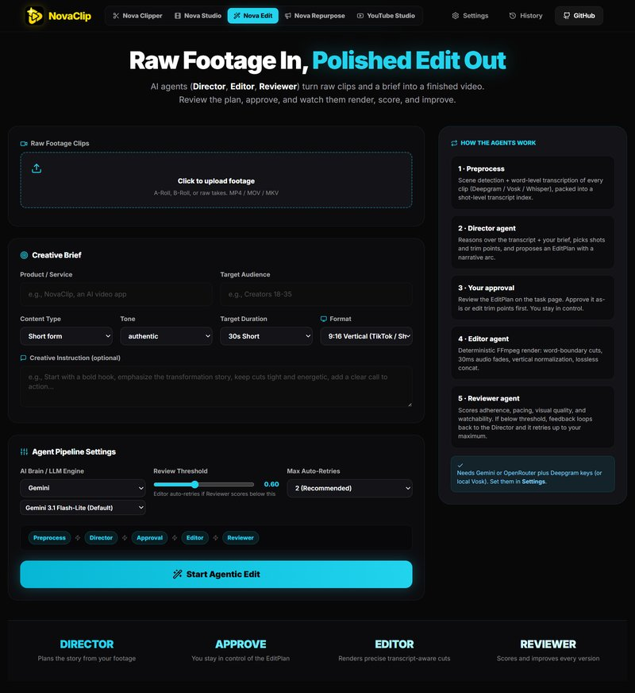
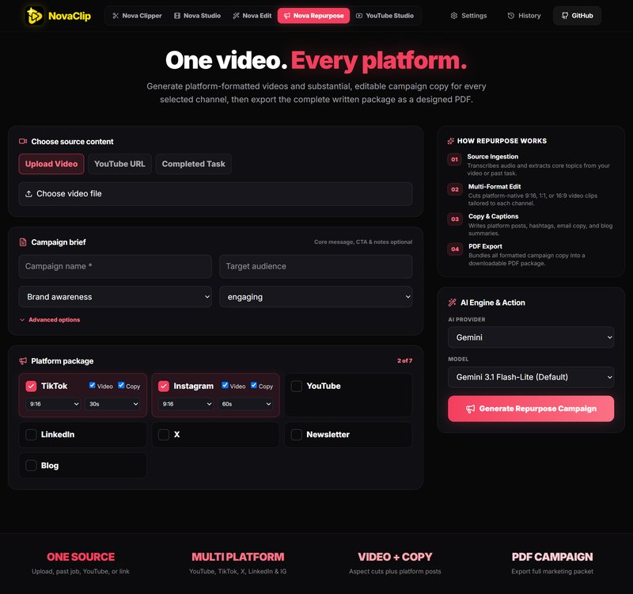
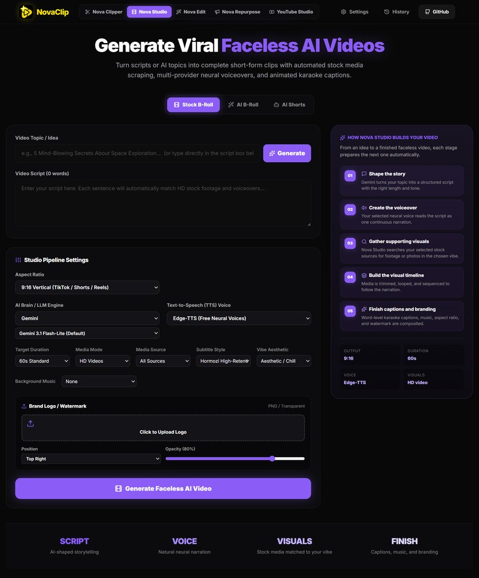
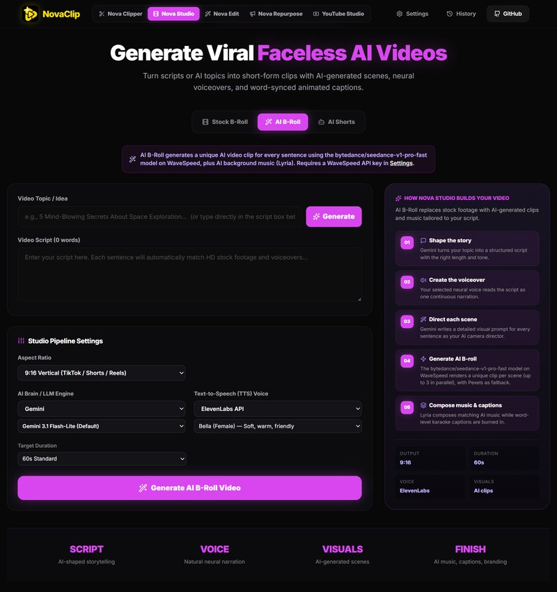
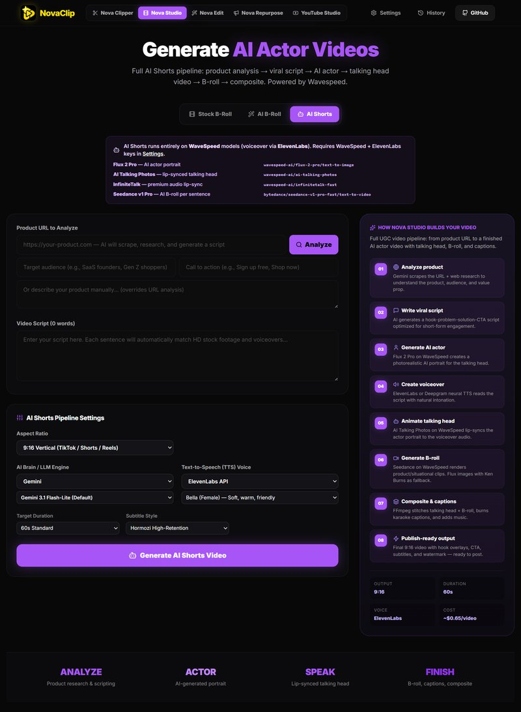
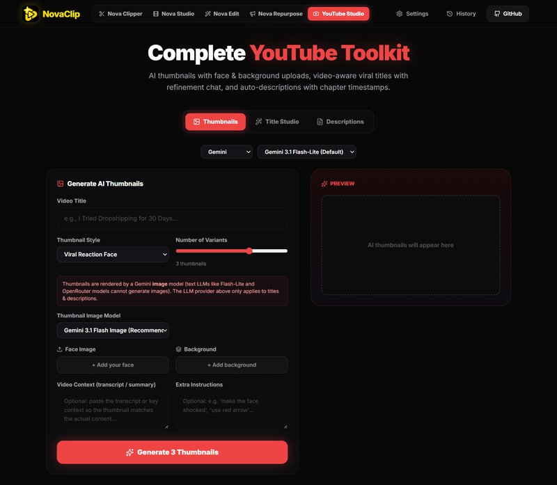
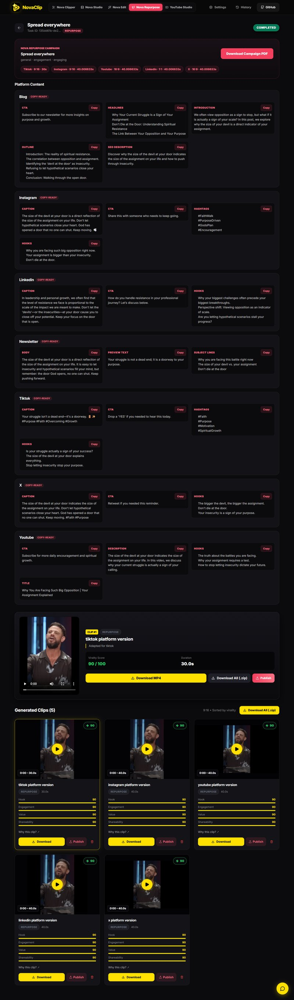

<div align="center">


# **NovaClip**

### **One toolkit for every kind of video - clipping, AI creation, agentic editing, repurposing, and packaging.**

Take a podcast, stream, or raw footage and turn it into viral clips, a faceless AI video, a UGC-style AI Shorts ad, a human-approved agentic edit, or a full multi-platform repurpose campaign - then publish it straight to YouTube, TikTok, and Instagram.

[](https://www.rust-lang.org/)
[](https://github.com/tokio-rs/axum)
[](https://react.dev/)
[](https://www.typescriptlang.org/)
[](https://www.python.org/)
[](https://vitejs.dev/)
[](https://ai.google.dev/)
[](https://openrouter.ai/)
[](https://deepgram.com/)
[](https://elevenlabs.io/)
[](https://wavespeed.ai/)
[](https://ffmpeg.org/)
[](https://www.sqlite.org/)
[](https://www.docker.com/)

</div>

---

## 🗺️ Modes at a Glance

NovaClip is organized as a set of independent "modes", each with its own tab in
the top navigation. Modes with internal tabs are noted below.

| Mode | Tab(s) | What it does |
|---|---|---|
| **Nova Clipper** | - | Paste a YouTube URL, upload footage, or pick a local file → transcribe, score virality, auto-crop, burn captions, export clips. |
| **Nova Studio** | `Stock B-Roll` · `AI B-Roll` · `AI Shorts` | Generate complete faceless videos from a topic or script - stock or AI-generated visuals - or turn a product URL into a UGC-style AI actor ad. |
| **Nova Edit** | - | Agentic editing: upload raw footage + a creative brief → Director plans → you approve → Editor renders → Reviewer scores. |
| **Nova Repurpose** | - | Turn one video/campaign into per-platform variants (TikTok, Instagram, YouTube, LinkedIn, X) plus AI-written newsletter/blog copy and a campaign PDF. |
| **YouTube Studio** | `Thumbnails` · `Title Studio` · `Descriptions` | Content-packaging toolkit: AI thumbnails (with face/background uploads), viral title generation + refinement chat, and SEO descriptions with chapter timestamps. |
| **History** | - | Every task across all modes, with filters and dedicated styling per mode. |

> **MCP server** - the entire pipeline is also exposed programmatically via a
> Model Context Protocol endpoint (`POST /mcp`), so AI assistants can drive NovaClip
> end-to-end. [Jump to MCP](#-mcp-server).

---

## 📸 Screenshots

<table>
  <tr>
    <td colspan="2" align="center">
      
      <br/><em>Nova Clipper - Task &amp; clip review</em>
    </td>
  </tr>
  <tr>
    <td align="center"><br/><em>Nova Clipper - viral clip generator</em></td>
    <td align="center"><br/><em>Nova Edit - agentic video editor</em></td>
  </tr>
  <tr>
    <td align="center"><br/><em>Nova Repurpose</em></td>
    <td align="center"><br/><em>Nova Studio - Stock B-Roll</em></td>
  </tr>
  <tr>
    <td align="center"><br/><em>Nova Studio - AI B-Roll</em></td>
    <td align="center"><br/><em>Nova Studio - AI Shorts</em></td>
  </tr>
  <tr>
    <td align="center"><br/><em>YouTube Studio - thumbnails, titles, descriptions</em></td>
    <td align="center"><br/><em>Nova Repurpose - Task &amp; campaign review</em></td>
  </tr>
</table>

---

## 🫶 Want to contribute?

**Contributions are highly welcome and needed.** Every part of NovaClip - the
forms, workflows, UI/UX, backend, integrations, performance, and docs - can be
improved, and every improvement counts. See [Contributing](#-contributing).

---

## ✨ Features

- **Nova Clipper - viral clip generation**: transcribe speech, AI-score candidate
  segments (hook, retention, emotion, shareability), smart multi-aspect cropping
  (9:16 / 1:1 / 16:9), animated captions, and export individual clips or a ZIP.
- **Nova Studio - faceless AI creation**: from a topic or script to a finished
  video with a single continuous voiceover, word-level karaoke captions, music,
  and branding. Two visual modes - **Stock B-Roll** (Pexels/Pixabay/Pinterest)
  and **AI B-Roll** (WaveSpeed Seedance clips with Pexels fallback + optional
  Lyria AI music).
- **Nova Studio - AI Shorts**: product URL → script → WaveSpeed AI actor
  (Flux 2 Pro portrait, AI Talking Photos / InfiniteTalk lip-sync) → Seedance
  B-roll → captioned, publish-ready 9:16 video.
- **Nova Edit - agentic editing**: footage index + visual analysis → Director
  proposes an EditPlan → human approval → Editor renders → Reviewer scores and
  auto-retries. Natural-language revisions like *"make it shorter"*.
- **Nova Repurpose**: one video/campaign → platform-optimized variants
  (`tiktok_video.mp4`, `instagram_video.mp4`, …) + AI-written newsletter/blog
  copy + downloadable campaign PDF.
- **YouTube Studio tools**: Gemini image-model thumbnails (face/background
  uploads, up to 4 variants), viral titles with refinement chat, and SEO
  descriptions with auto chapter timestamps.
- **One-click publishing**: post any generated video (clip, final, or repurposed
  variant) to **YouTube, TikTok, and/or Instagram** via Upload-Post.
- **Provider-based AI model selection**: choose **Gemini** or **OpenRouter**
  independently per mode; Nova Edit exposes free multimodal models for footage
  vision analysis.
- **Multi-provider STT**: Deepgram Nova-3 (cloud, diarization), Vosk Local
  (offline CPU), or Whisper Local ([`ggml-base.bin`](https://huggingface.co/ggerganov/whisper.cpp/blob/main/ggml-base.bin),
  offline).
- **Multi-provider TTS**: Edge-TTS (free), ElevenLabs (character-aligned
  timestamps), or Deepgram Aura - with `-shortest` audio/video sync.
- **Global ASS karaoke subtitles**: multi-color active word-pop captions from
  any TTS provider, one `.ass` file, exact per-word timing.
- **Typography & captions**: 12 fonts, font-size control, caption color palette,
  4 caption animations, NLP emoji auto-insertion, and 22+ language translation.
- **Brand watermark overlay**: transparent PNG/WEBP/JPEG logo with position and
  opacity controls, looped across the whole video.
- **AI vertical reframe & split-screen**: YOLO + MediaPipe subject tracking with
  Single / Split-Screen / Auto camera modes and speaker diarization.
- **Originality boost**: brightness/contrast/saturation tweaks to alter video
  hashes.
- **100% BYOK**: bring your own keys - stored only in your browser.

---

## 🎬 Mode Deep-Dives

### Nova Clipper - Viral Clip Generator

Paste a YouTube URL, upload footage, or pick a local file. NovaClip downloads and
transcribes it, then AI-scores every candidate segment for hook strength,
retention, emotional peaks, and shareability. Clips are smart-cropped for
vertical/shorts or square, captions are burned in, and you can download each clip
or everything as a ZIP. A floating chat panel lets you edit clips with natural
language (trim, delete, reframe, captions, translate, merge).

### Nova Studio - Faceless AI Creator (3 sub-modes)

Each sub-mode gets its own accent color so you always know where you are:
**violet** for Stock B-Roll, **fuchsia** for AI B-Roll, **purple** for AI Shorts.

**Stock B-Roll** - the original faceless flow. Searches **Pexels** & **Pixabay**
by keyword (Pinterest scraper as fallback), downloads HD video/photo clips, and
trims each to its voiceover segment.

**AI B-Roll** - renders a unique AI video clip per sentence via
`bytedance/seedance-v1-pro-fast` on **WaveSpeed** (up to 3 clips in parallel,
Pexels fallback, black frames last resort). Optional **Lyria** AI background
music (SoundHelix fallback).

**AI Shorts** - a UGC-style vertical ad with a synthetic presenter, scoped to the
pipeline (WaveSpeed + ElevenLabs only):

1. **Analyze** - Gemini researches the product URL and writes a viral script.
2. **Actor** - **Flux 2 Pro** (`wavespeed-ai/flux-2-pro/text-to-image`) creates a
   photoreal 9:16 portrait; **AI Talking Photos** or **InfiniteTalk** (premium)
   lip-syncs it to the hook.
3. **B-roll** - **Seedance** generates one clip per sentence in parallel.
4. **Render** - talking head anchors scene 0, B-roll covers the rest, captions
   and voiceover are mixed into `final_video.mp4`.
5. **Publish (optional)** - auto-post to YouTube via Upload-Post.

> **WaveSpeed models used by AI Shorts** (also shown on the page): Flux 2 Pro,
> AI Talking Photos, InfiniteTalk (`wavespeed-ai/infinitetalk-fast`, premium),
> Seedance v1 Pro.

### Nova Edit - Agentic Video Editor

Upload one or more footage files (A-roll, B-roll, interviews, product, multi-cam)
plus a creative brief. Nova Edit detects scenes, transcribes speech, and analyzes
representative frames with a vision-capable model to build a footage index. The
**Director** proposes an ordered EditPlan (shots, trims, overlays). You review
and approve, the **Editor** renders the cut, and the **Reviewer** scores it and
auto-retries below your threshold. Works visual-only when there's no audio.
Short-form (20–90s) and long-form (2–60min) targets. *Not yet a full NLE -
transitions, color grading, keyframed motion graphics, and detailed audio mixing
are on the roadmap.*

### Nova Repurpose - One Video, Every Platform

Choose a source (a completed task, an uploaded file, or a YouTube URL), describe
your campaign (audience, goal, tone, core message, CTA), and pick platforms -
video variants for TikTok / Instagram / YouTube / LinkedIn / X, and written copy
for Newsletter / Blog. The worker renders each `{platform}_video.mp4` to its
target aspect ratio and duration, generates AI-written copy, and gives you a
downloadable campaign PDF.

### YouTube Studio - Content Packaging Toolkit (3 tabs)

**Not an uploader** - it generates the packaging (thumbnails, titles,
descriptions) for your videos. Posting is handled by Upload-Post.

- **Thumbnails**: up to 4 branded 16:9 variants rendered by a Gemini **image**
  model (`gemini-3.1-flash-image-preview` by default; overridable via the
  "Thumbnail Image Model" dropdown or `GEMINI_THUMBNAIL_MODEL`). Optional face
  photo and background image, style presets, and design-rationale prompts.
- **Title Studio**: viral/educational/story/controversial/listicle tones, 5–20
  candidates, video upload or transcript for content-aware titles, and a
  refinement chat.
- **Descriptions**: full SEO-ready description from a YouTube URL (auto transcript),
  pasted transcript, or uploaded video - with chapter timestamps.

The LLM selector (Gemini / OpenRouter) applies to **text only**; thumbnails
always use your **Gemini** key with an image-capable model (text LLMs like
Flash-Lite and OpenRouter models can't generate images).

### Social Posting (Upload-Post)

Every generated video - Clipper clips, AI Shorts `final_video.mp4`, Nova Edit
cuts, Repurpose platform variants - can be posted to **YouTube, TikTok, and/or
Instagram**:

- **UI**: the "Publish" button on clip cards, the featured player, and "Publish
  Final Video" (`POST /tasks/{id}/publish`).
- **MCP**: the `publish_clip` tool does the same programmatically.
- Upload-Post supports 13+ platforms in total; add more by extending
  `uploadpost.rs::publish_video`.

---

## 🤖 MCP Server (Model Context Protocol)

NovaClip exposes its entire pipeline at **`POST /mcp`**
(`http://localhost:8000/mcp`) via JSON-RPC 2.0 over HTTP - the same surface the
UI uses. Connect Claude Desktop, Cursor, or any MCP client.

**All 15 tools are implemented:**

| Tool | Purpose |
|---|---|
| `process_video` | Submit a YouTube URL or uploaded video path for clipping → task UUID |
| `get_job_status` | Poll task status/progress |
| `list_clips` | List a completed task's clips with file URLs |
| `get_quota` | Task count in the system |
| `add_subtitles` | Burn styled captions (classic/karaoke) onto an existing clip |
| `publish_clip` | Post a clip to YouTube/TikTok/Instagram via Upload-Post |
| `create_shorts_video` | Kick off an AI Shorts task (script → actor → B-roll → render, optional auto-publish) |
| `run_ai_edit` | Apply a natural-language edit to clips (trim/delete/captions/translate/merge…) |
| `cancel_task` | Cancel a queued/running task |
| `resume_task` | Resume a failed task |
| `trim_clip` | Trim a clip to new offsets |
| `delete_clip` | Delete a clip |
| `generate_titles` | Gemini title candidates from topic/transcript |
| `generate_description` | Gemini description from topic/transcript |
| `generate_thumbnail` | Gemini thumbnail variants (data-URL PNGs) |

List tools:

```bash
curl -s -X POST http://localhost:8000/mcp \
  -H "Content-Type: application/json" \
  -d '{"jsonrpc":"2.0","id":1,"method":"tools/list","params":{}}'
```

Publish the first clip of a job to TikTok + Instagram:

```bash
curl -s -X POST http://localhost:8000/mcp \
  -H "Content-Type: application/json" \
  -d '{"jsonrpc":"2.0","id":2,"method":"tools/call","params":{"name":"publish_clip","arguments":{"job_id":"<TASK_UUID>","clip_index":0,"platforms":["tiktok","instagram"],"api_key":"<UPLOADPOST_KEY>"}}}'
```

Client config:

```json
{
  "mcpServers": {
    "novaclip": {
      "type": "http",
      "url": "http://localhost:8000/mcp",
      "headers": { "Content-Type": "application/json" }
    }
  }
}
```

---

## 🧱 Tech Stack

| Layer | Technologies & Tools |
|---|---|
| **Backend API** | Rust, Axum 0.8, Tokio, SQLx + SQLite (WAL) |
| **Video Engine** | FFmpeg, yt-dlp, Tokio MPSC async queue, Playwright Chromium (Pinterest scraper), WaveSpeed Seedance/Lyria/Flux/Actor APIs |
| **Subject Tracking** | Python 3.11, Ultralytics YOLO11n-seg, MediaPipe Face/Pose, OpenCV, SceneDetect |
| **Speech AI / STT / TTS** | Deepgram Nova-3 STT, Vosk Local STT, Whisper Local, ElevenLabs, Edge-TTS, Deepgram Aura TTS |
| **LLM AI** | Google Gemini (text + image models), OpenRouter (free text/vision models) |
| **Frontend UI** | React 19, TypeScript, Vite 6, Framer Motion, Lucide Icons |
| **Packaging** | Docker, Docker Compose, Nginx, Makefile |

---

## 🚀 Quick Start

### Option A: Docker (recommended)

```bash
git clone https://github.com/samolubukun/NovaClip.git
cd NovaClip
docker-compose up -d --build
```

- Frontend: `http://localhost:3000`
- Backend: `http://localhost:8000`

### Option B: Native local setup

Prerequisites: Rust 1.80+, Node 18+, FFmpeg in PATH, yt-dlp (PATH or
`backend/yt-dlp.exe`), Python 3.11+.

```bash
# 1. Backend
cd backend
python -m venv novaclip_reframe/venv
novaclip_reframe/venv\Scripts\pip install --extra-index-url https://download.pytorch.org/whl/cpu \
    ultralytics>=8.3.0 mediapipe==0.10.14 opencv-python>=4.10.0.84 \
    scenedetect>=0.6.4 lap>=0.5.12
cargo run --bin novaclip-api

# 2. Frontend (new terminal)
cd frontend
npm install
npm run dev
```

---

## 🔑 BYOK (Bring Your Own Keys)

Zero vendor lock-in. Configure keys in the in-app **Settings Modal (⚙️)** -
they're stored only in your browser.

| Key | Needed for | Get it |
|---|---|---|
| **Gemini** | Scripts, scoring, translation, YouTube Studio text & thumbnails, Nova Edit | [Google AI Studio](https://ai.google.dev) |
| **OpenRouter** | Alternative free text/vision LLMs | [OpenRouter](https://openrouter.ai/keys) |
| **Deepgram** | STT (Nova-3) + Aura TTS | [Deepgram Console](https://console.deepgram.com) |
| **ElevenLabs** | Neural TTS (Studio, AI Shorts, captions) | [ElevenLabs](https://elevenlabs.io/app/settings/api-keys) |
| **Pexels** | Stock B-roll search | [Pexels API](https://www.pexels.com/api/) |
| **Pixabay** | Stock B-roll search | [Pixabay API](https://pixabay.com/api/docs/) |
| **WaveSpeed** | AI B-Roll, AI Shorts (actor/lip-sync/B-roll), Lyria music | [WaveSpeed](https://platform.wavespeed.ai/) |
| **Upload-Post** | One-click publishing (YouTube/TikTok/Instagram) | [Upload-Post](https://app.upload-post.com/api-keys) |

---

## 📁 Repository Structure

```
NovaClip/
├── backend/
│   ├── crates/
│   │   ├── api/          # Axum HTTP routes & SSE progress streaming
│   │   │   └── src/routes/ (tasks, ai_edit, media, youtube_studio, mcp, ...)
│   │   ├── db/           # SQLite database models & SQLx queries
│   │   └── worker/       # Video processing pipeline
│   │       └── src/pipeline/ (clip, caption, reframe, tts, scraper,
│   │                         studio_llm, wavespeed, nova_edit, repurpose, ...)
│   ├── novaclip_reframe/ # Python package for AI vertical reframe (YOLO + MediaPipe)
│   ├── migrations/       # Database SQL schema migrations
│   └── Cargo.toml
├── frontend/
│   ├── src/
│   │   ├── pages/        # Home (Clipper), Studio, NovaEdit, Repurpose,
│   │   │                 # YouTubeStudio, Task, History
│   │   ├── components/   # Nav, SettingsModal, shared UI
│   │   └── lib/          # API client, SSE listeners, model lists
│   └── package.json
├── docker-compose.yml
├── Makefile
├── LICENSE
└── CONTRIBUTING.md
```

---

## 🗓️ Roadmap

Current focus areas and planned work (all open for contribution):

- **🖥️ Tauri 2 desktop app** - native packaging of the whole stack with
  auto-updates, a tray/offline experience, and one-click local runs. *A major
  goal.*
- **Resilience & reliability** - harden the prototype pipelines (AI Shorts,
  YouTube Studio, Nova Edit): more fallbacks, retries, timeouts, and clear
  error surfacing.
- **More models & providers** - configurable WaveSpeed video models, new Gemini
  image models, local/offline LLMs (Ollama), and additional STT/TTS providers.
- **Publishing** - more platforms in Upload-Post integration, native uploaders
  (YouTube Data API, TikTok, IG Graph), scheduling, and metadata presets.
- **Nova Edit 2.0** - transitions, color grading, music, multi-track audio, and
  finer approval controls.
- **Studio** - multi-actor AI Shorts, voice cloning, longer durations, batch
  generation, and cost controls.
- **Performance** - deeper parallelization, smarter queueing, FFmpeg
  efficiency, and memory tuning.
- **MCP expansion** - more tools (repurpose, YouTube Studio, scheduling),
  richer schemas, and better error contracts.
- **Tests & CI** - automated test suite, lint pipeline, and release automation.

---

## 🤝 Contributing

**Contributions are welcome - and genuinely needed.** This is a young,
prototype-heavy project: AI Shorts, YouTube Studio, Nova Edit, and the various
integrations can break, and the whole codebase benefits from fresh eyes. Whether
it's a bug report, a fallback, a new integration, a performance fix, or a
feature, we'd love your help.

- **[Read the contributing guide](CONTRIBUTING.md)** - setup, workflow, and
  conventions.
- Please follow our [Code of Conduct](CODE_OF_CONDUCT.md).
- Report vulnerabilities privately per the [Security Policy](SECURITY.md) -
  do not file them as public issues.
- Open issues for bugs and feature ideas (templates provided).
- PRs should compile clean: `cargo check -p novaclip-api -p novaclip-worker` and
  `npx tsc -b`.
- Check the [Roadmap](#-roadmap) for high-impact areas like the **Tauri desktop
  build**, tests/CI, and pipeline hardening.

---

## 📜 License

Distributed under the **MIT License**. See [LICENSE](LICENSE).

MIT License © [Samuel Olubukun](https://github.com/samolubukun)
